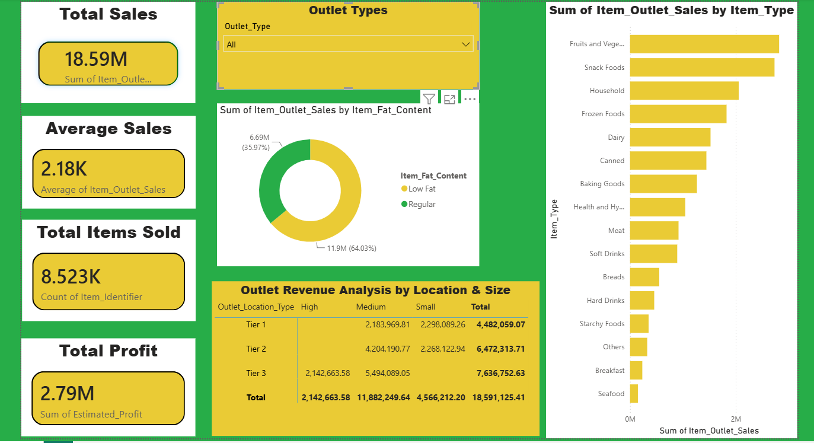

# Blinkit End-to-End Quick Commerce Analysis

An end-to-end data analytics project simulating a Quick-Commerce business model (Blinkit). This project covers the entire data pipeline lifecycle: Data Cleaning & Feature Engineering using **Python**, Deep Data Exploration using **SQL**, and Interactive Business Intelligence Reporting via **Power BI**.

---

## 🛠️ Tech Stack & Tools Used
* **Data Cleaning:** Python (Pandas, NumPy)
* **Database Exploration:** SQL (MySQL)
* **Business Intelligence:** Power BI Desktop

---

## 🔄 Project Phase Lifecycle

### Phase 1: Python Data Cleaning & Feature Engineering
The raw dataset contained missing tracking variables and non-standardized categorical fields. 
* Imputed missing values in `Item_Weight` using the categorical mean.
* Handled missing elements in `Outlet_Size` by replacing nulls with the statistical mode ('Medium').
* Standardized categorical inconsistencies within `Item_Fat_Content` (mapping 'LF', 'low fat', and 'reg' to uniform 'Low Fat' and 'Regular' tags).
* Engineered a new column `Estimated_Profit` assuming a baseline 15% profit margin on total outlet sales.

### Phase 2: SQL Data Exploration
The cleaned dataset was imported into a relational SQL database schema (`blinkit_sales`). Advanced queries were written to isolate key operational constraints:
* Formulated core corporate KPIs (Total Revenue, Average Sales Margin, and Item Volumetric Output).
* Grouped store revenue ranks across distinct localized tiers (Tier 1, Tier 2, Tier 3) using SQL Window Functions (`RANK() OVER PARTITION BY`).
* Extracted total sales metrics segmented by product category demand profiles.

### Phase 3: Interactive Power BI Dashboard Design
An executive-level interactive business dashboard was created to dynamically display operations metrics:
* **KPI Header Cards:** Immediate visibility into Total Sales, Total Profit, Average Revenue per Order, and Total Unit Counts.
* **Category Revenue Bars:** A descending horizontal distribution chart evaluating product performance.
* **Customer Preference Split:** A donut chart outlining consumer behavior metrics regarding fat-content choices.
* **Store Tier Matrix:** A cross-tab analytical matrix evaluating spatial store sizes across urban tiers.

---

## 📊 Dashboard Preview

---

## 💡 Core Business Insights Derived
1. **Top Categories:** Fruits & Vegetables and Snack Foods drive the highest total revenue for the business.
2. **Geographical Performance:** Medium-sized outlets located within Tier 2 and Tier 3 regions display higher operational revenue outcomes compared to smaller structures.
3. **Consumer Preference:** Low Fat variants dominate total sales volume versus regular items, signaling a strong consumer alignment toward health-conscious choices.
